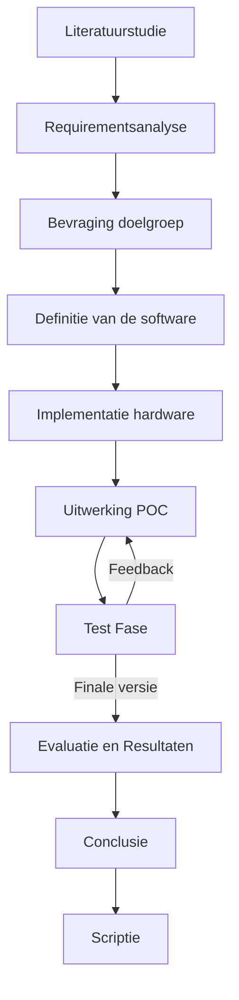

### Flowchart

```mermaid
flowchart TD
  A[Literatuurstudie]
  A --> B[Requirementsanalyse];
  B --> C[Bevraging doelgroep];
  C --> D[Definitie van de software];
  D --> E[Implementatie hardware];
  E --> F[Uitwerking POC];
  F --> G[Test Fase];
  G -->|Feedback|F[Uitwerking POC]
  G --> |Finale versie|H[Evaluatie en Resultaten];
  H --> I[Conclusie];
  I --> J[Scriptie];

```
